# Architecture Diagram - Helix Education Center V.2

## Overview

This diagram illustrates the complete lifecycle of the Helix Education Center V.2, showing how all components interact through event sourcing to deliver a personalized learning experience.

## System Architecture Flowchart

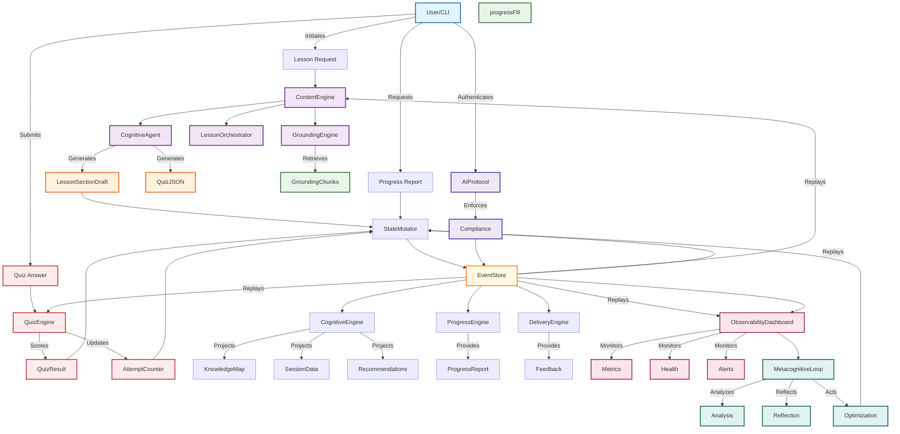

## Detailed Component Interactions

### 1. User Interface Flow

**Entry Points:**
- **Lesson Request**: User selects a topic → System generates personalized lesson
- **Quiz Answer**: User completes quiz → System scores and provides feedback
- **Progress Report**: User requests learning progress → System provides analytics

**User Journey:**
```text
User → Lesson Request → ContentEngine → GroundingEngine + CognitiveAgent → LessonOrchestrator → StateMutator → EventStore
```

### 2. Content Generation Pipeline

**Sequential Processing:**
1. **Grounding**: Retrieve external context for topic
2. **Cognitive Generation**: Create lesson section and quiz JSON
3. **Orchestration**: Combine into complete lesson with quiz
4. **State Update**: Commit to event store

**Key Components:**
- `GroundingEngine`: Fetches relevant external context
- `CognitiveAgent`: Generates content using LLM
- `LessonOrchestrator`: Coordinates content assembly
- `StateMutator`: Updates learning state

### 3. Quiz Processing Flow

**Scoring Pipeline:**
1. **User Input**: User submits quiz answers
2. **QuizEngine**: Scores answers deterministically
3. **State Update**: Records attempts and results
4. **Feedback**: Generates human-readable feedback

**Deterministic Scoring:**
```text
User Answer → QuizEngine → ScoringEngine → QuizResult → StateMutator → EventStore
```

### 4. Event Sourcing Architecture

**Immutable Ledger:**
- **EventStore**: All system changes as append-only events
- **Reconstruction**: State derived from event replay
- **Audit Trail**: Complete history of all operations
- **Compliance**: Constitutional mandates enforced

**Event Flow:**
```text
StateMutator → EventStore → All Consumers (CognitiveEngine, ProgressEngine, ObservabilityDashboard)
```

### 5. Cognitive Engine Projections

**Knowledge Management:**
- **KnowledgeMap**: Projects learner strengths/weaknesses from events
- **SessionData**: Tracks learning interactions and patterns
- **Recommendations**: Suggests next learning actions

**Projection Pipeline:**
```text
EventStore → CognitiveEngine → KnowledgeMap + SessionData + Recommendations
```

### 6. Observability & Metacognitive Loop

**Continuous Improvement:**
1. **Monitoring**: Real-time system metrics and health
2. **Analysis**: Pattern identification and optimization opportunities
3. **Reflection**: Effectiveness evaluation and improvement areas
4. **Action**: Implementation of optimizations

**Loop Integration:**
```text
ObservabilityDashboard → MetacognitiveLoop → Analysis → Reflection → Optimization → StateMutator
```

### 7. AI Protocol & Compliance

**Governance Framework:**
- **Authentication**: All AI agents sign-in via ROOT_BOOT.md
- **Documentation**: Immediate .md file updates for code changes
- **Audit Trail**: Complete session logging in SESSION_LOG.md
- **Protocol Enforcement**: Constitutional mandates compliance

**Compliance Flow:**
```text
User → AIProtocol → ComplianceCheck → EventStore
```

## Component Dependencies

### Core Dependencies

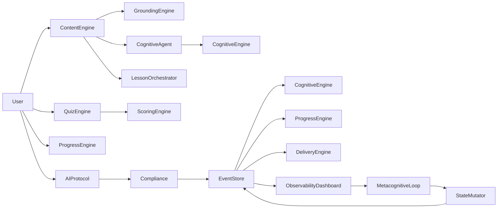

## Data Flow Sequence

### Complete Lifecycle

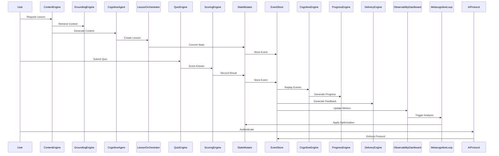

## State Management Flow

### Event-Driven State Updates

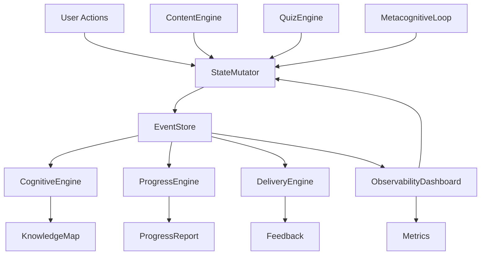

## Compliance & Audit Flow

### Constitutional Enforcement

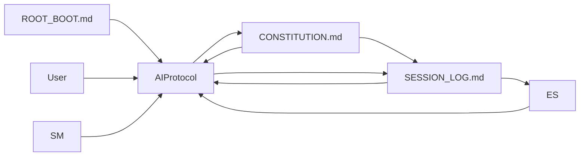

## Key Performance Characteristics

### Event Sourcing Benefits

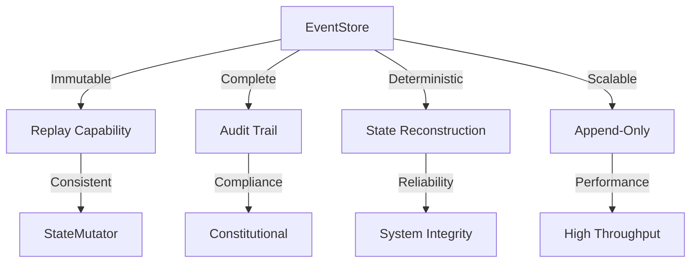

## Integration Points

### External System Connections

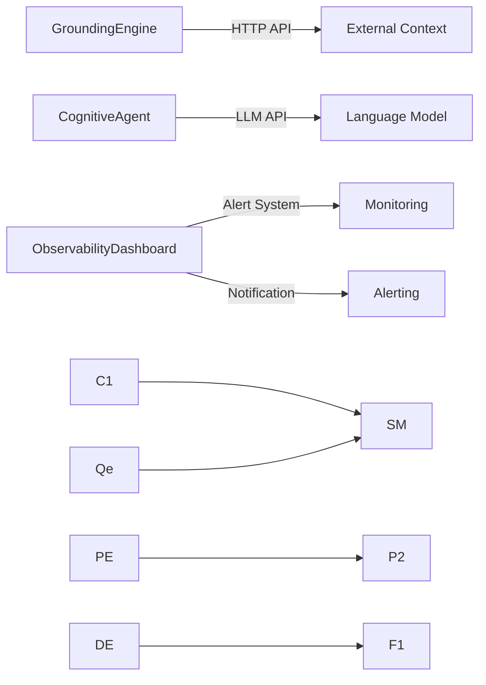

## Error Handling & Recovery

### Fault Tolerance

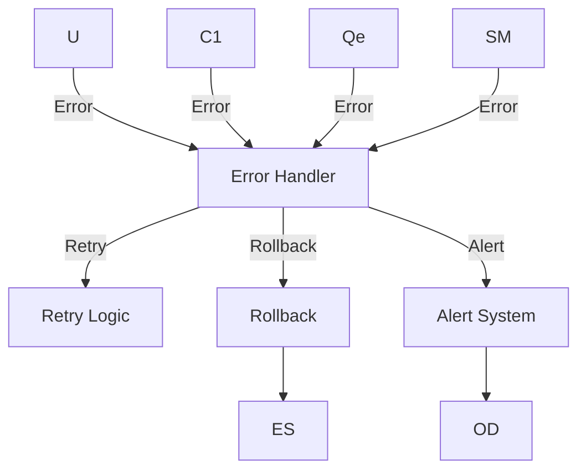

## Security & Access Control

### Authentication & Authorization

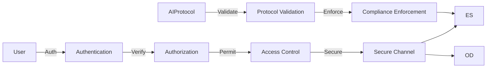

## Monitoring & Alerting

### Observability Stack

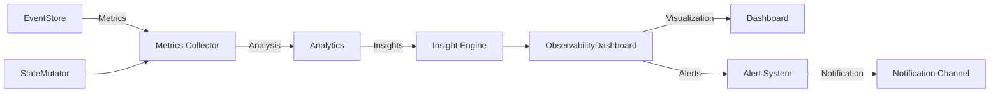

## Deployment Architecture

### Component Deployment

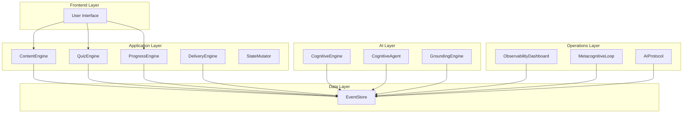

## Architecture Summary

### Core Principles

1. **Event Sourcing**: All state changes as immutable events
2. **Deterministic Processing**: Same inputs → same outputs
3. **Explicit Interfaces**: Components communicate through defined contracts
4. **Append-Only Durability**: Events never mutated or deleted
5. **Constitutional Compliance**: All decisions governed by core principles

### Key Components

- **User Interface**: Direct interaction point for learners
- **ContentEngine**: Lesson generation and orchestration
- **QuizEngine**: Deterministic quiz scoring and management
- **StateMutator**: Controlled, auditable state modifications
- **EventStore**: Immutable ledger of all system changes
- **CognitiveEngine**: Knowledge projection and recommendations
- **ProgressEngine**: Learning path and milestone tracking
- **DeliveryEngine**: Feedback and session management
- **ObservabilityDashboard**: Real-time system monitoring
- **MetacognitiveLoop**: Continuous improvement framework
- **AIProtocol**: AI agent compliance and governance

### Data Flow

1. **User Actions**: Trigger state changes through StateMutator
2. **Event Storage**: All changes recorded in EventStore
3. **State Reconstruction**: System state derived from event replay
4. **Component Projections**: Cognitive, Progress, and Delivery engines read events
5. **Observability**: Dashboard monitors system health and performance
6. **Continuous Improvement**: Metacognitive loop analyzes and optimizes

This architecture ensures a robust, scalable, and compliant learning system that maintains complete audit trails while delivering personalized educational experiences.
